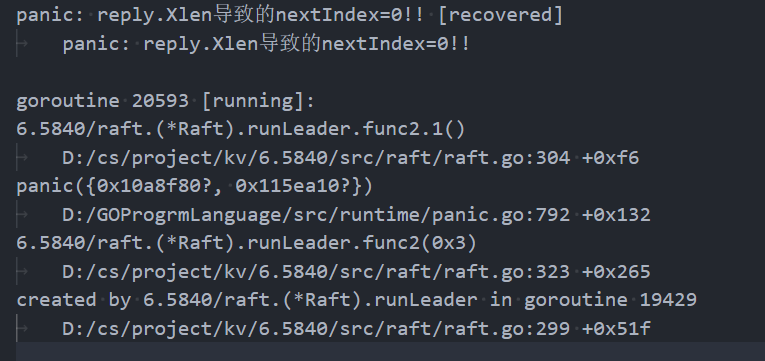

呃呃,调试得太惨了

$ time go test -run 3C
Test (3C): basic persistence ...
  ... Passed --   3.9  3   80   21018    6
Test (3C): more persistence ...
  ... Passed --  18.2  5 1072  233250   16
Test (3C): partitioned leader and one follower crash, leader restarts ...
  ... Passed --   1.7  3   34    8704    4
Test (3C): Figure 8 ...
  ... Passed --  31.9  5 1104  227793   35
Test (3C): unreliable agreement ...
  ... Passed --  10.6  5  420  132066  246
Test (3C): Figure 8 (unreliable) ...
  ... Passed --  32.2  5 2900 6352973  125
Test (3C): churn ...
  ... Passed --  16.5  5  740  361345  182
Test (3C): unreliable churn ...
  ... Passed --  16.5  5  772  454999  125
PASS
ok      6.5840/raft     131.663s
real    2m 12.96s
user    0m 0.09s
sys     0m 0.29s